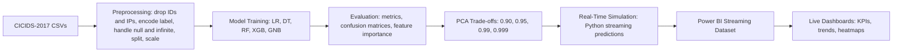
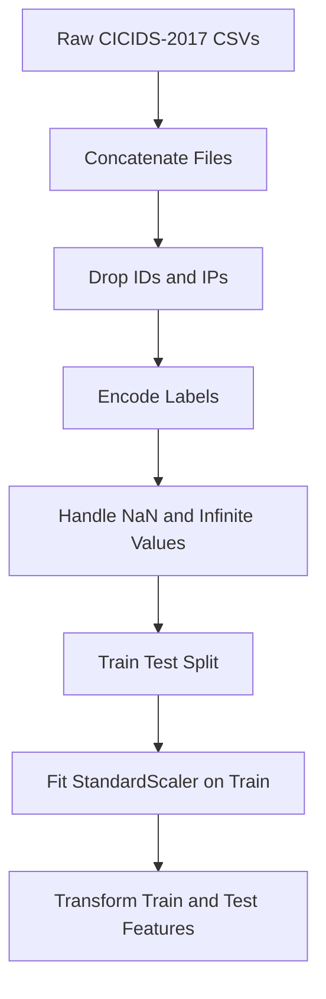
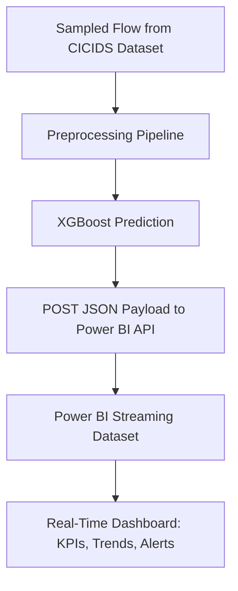
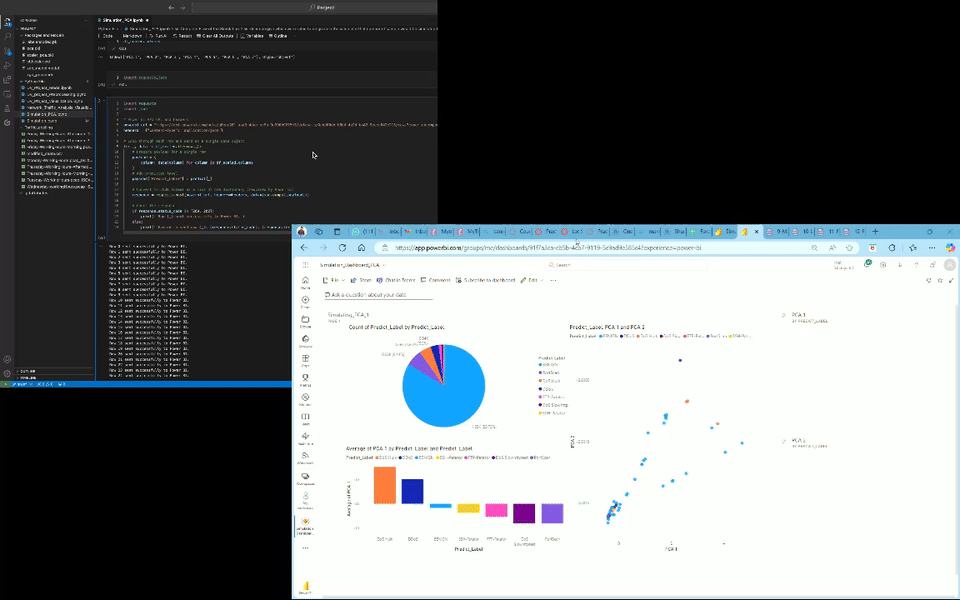
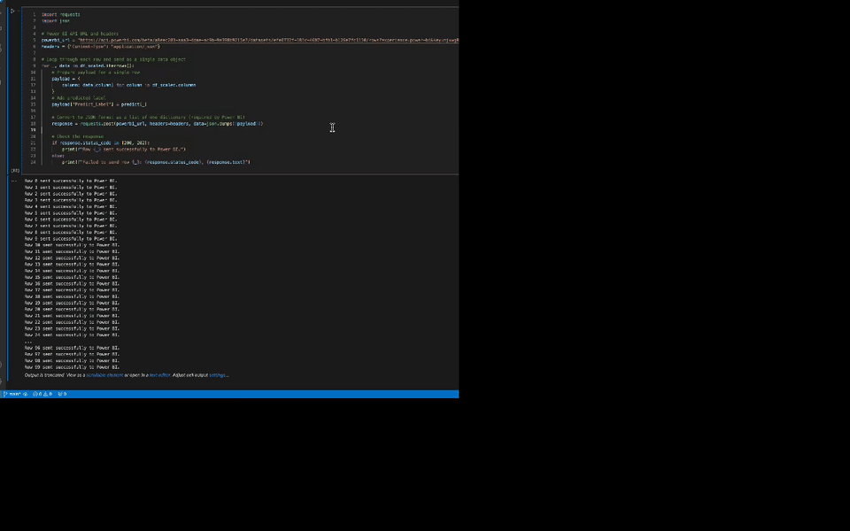

# Data Analysis for Network Traffic (CICIDS-2017)

**Purpose**  
Build an end-to-end **intrusion detection analytics pipeline** that transforms raw network traffic into **clean features**, evaluates multiple **ML classifiers** (LogReg, DT, RF, XGBoost, GNB), performs **dimensionality reduction** via PCA (accuracy vs. speed trade-offs), and **simulates real-time** monitoring by streaming predictions to **Power BI** dashboards.

**What this showcases**  
- **Data Engineering**: robust preprocessing (null/∞ handling, label encoding, leakage-safe scaling)  
- **Data Analysis**: EDA, correlation analysis, attack distributions, protocol analysis  
- **Machine Learning**: multi-model training & evaluation; confusion matrices; feature importance; metrics comparison  
- **Optimization**: **PCA** variance thresholds → **speed vs. accuracy** decisions for real-time scenarios  
- **Visualization**: Power BI **live dashboards** from a Python streaming pipeline  
- **Reproducibility**: notebook-driven workflow with saved artifacts (scalers/models)

**Key Outcomes**  
- Clear **model comparison** with XGBoost as a top performer (see Results)  
- **PCA@0.99** yields a strong latency/accuracy balance for “real-time” simulation  
- **Operational flow** from raw CSVs → features → model → streaming → dashboard

----
</br>

<!-- Hero visuals (from your repo's /images folder) -->
<p align="center">
  
  
</p>

----

## System Overview

**Flow**
1) **Ingest** CICIDS-2017 daily CSVs  
2) **Preprocess**: drop IDs/IPs/timestamps → encode label → handle null/∞ → train/test split → fit **StandardScaler on train only**  
3) **Model**: train LR, DT, RF, XGB, GNB → evaluate (Accuracy, Precision, Recall, F1, MCC) → confusion matrices  
4) **Optimize**: evaluate **PCA** at variance thresholds (0.90/0.95/0.99/0.999) → select trade-off for real-time  
5) **Simulate real-time**: Python loop → preprocess + predict → POST to **Power BI** Streaming Dataset  
6) **Visualize**: live tiles & reports (daily trends, flagged events, heatmaps, KPIs)

### onceptual Diagram



### Why This Design?

- Keeps **data leakage** out by scaling *after* the split  
- Compares **classical ML models** for interpretable baselines and production-friendly performance  
- Uses **PCA** only where it helps latency, not blindly everywhere  
- Separates **batch evaluation** from **streaming simulation** to mirror real ops  

---

<!-- Optional second visual for architecture section -->
<p align="center">
  
</p>

---

## 2) Dataset & Challenges

**Dataset: [CICIDS-2017](https://www.unb.ca/cic/datasets/ids-2017.html)**  
- One of the most widely used **Intrusion Detection System (IDS)** benchmarks.  
- Traffic captured over 5 days in 2017 at the University of New Brunswick.  
- **Mix of benign and malicious flows**: DDoS, PortScan, Botnet, Infiltration, Heartbleed, etc.  
- **80+ features**: packet counts, byte rates, flags, durations, header stats.  

### Key Properties
- **Multi-class labels** (`BENIGN` + multiple attack types)  
- **Highly imbalanced**: e.g., some attack types dominate, others are rare  
- **Mixed data types**: integers, floats, categorical (protocols)  
- **Dirty fields**: nulls, “Infinity” in rate features, non-informative IDs (Flow ID, IP addresses)  

---

### Distribution Examples

**Attack distribution**
<p align="center">
  
</p>

**Protocol counts**
<p align="center">
  
  
</p>

---

### Data Cleaning Challenges

1. **Irrelevant IDs**  
   - `Flow ID`, `Source IP`, `Destination IP`, `Timestamp` → removed  
   - Why? They don’t generalize for detection, and may cause leakage.  

2. **Missing Values**  
   - Features like `Flow Bytes/s` had **nulls** → imputed (safe defaults / median).  

3. **Infinite Values**  
   - Rate-based features sometimes yielded **∞** (e.g., division by zero).  
   - Replaced with capped values / imputed safely.  

4. **Skewed Classes**  
   - Some attacks extremely under-represented.  
   - Approached as a **binary detection problem (Benign vs Malicious)** first.  

5. **Mixed Data Types**  
   - Encoded labels (`BENIGN=0`, `ATTACK=1`).  
   - Continuous features scaled using **StandardScaler** (fit only on train split).  

---

### Column Type Mix

<p align="center">
  
</p>


---

## 3) Data Engineering Pipeline

Turning CICIDS-2017 raw CSVs into **ML-ready features** required a robust preprocessing pipeline.  
Every transformation was chosen to **improve generalization, avoid leakage, and stabilize training**.

---

### Step-by-Step Transformations

1. **Concatenate Daily Files**  
   - CICIDS-2017 is split across multiple CSVs (per day).  
   - Merged into a **single unified dataset** for consistency.  

2. **Drop Identifiers & Non-Informative Fields**  
   - Removed: `Flow ID`, `Source IP`, `Destination IP`, `Timestamp`.  
   - *Reason*: These carry unique/session-specific values, not predictive patterns. Keeping them risks **data leakage**.

3. **Label Encoding**  
   - Converted `Label` → **binary classification** (`0 = Benign`, `1 = Attack`).  
   - *Reason*: Models perform better with numeric encoding, and binary framing avoids extreme class imbalance.

4. **Missing Value Handling**  
   - Columns like `Flow Bytes/s`, `Flow Packets/s` contained **NaNs**.  
   - Imputed using **median values** (robust against skew).  

5. **Infinity Replacement**  
   - Some flow features (rates, divisions) produced **∞** values.  
   - Strategy: Replace with column maximum or safe constant.  
   - *Reason*: Avoids math errors and ensures consistency.

6. **Train-Test Split (80/20)**  
   - Ensured **random shuffling** while preserving label balance.  
   - *Reason*: Avoid contamination of train/test.

7. **Scaling with StandardScaler**  
   - Fit **only on training data**, then applied to test.  
   - *Reason*: Prevents data leakage (test info influencing scaling).  
   - Scaling critical since models like Logistic Regression and XGBoost are sensitive to feature magnitudes.

---

### Preprocessing Pipeline (Conceptual)



### Why This Matters

- **Leakage-safe scaling** → ensures real-world robustness  
- **Consistent handling of ∞ & NaN** → prevents crashes during streaming simulation  
- **Binary framing** → provides a strong first baseline; later extensible to multi-class attacks  
- **Reproducibility** → scaler & models saved under `Packages/` and `Models/` for reuse  

---

## 4) Exploratory Data Analysis (EDA)

Before modeling, we **interrogated the dataset** to uncover signal, bias, and anomalies.  
This ensured that models were trained on **meaningful, stable features** — not noise.

---

### 4.1 Distribution of Attack Types
- Dataset is **heavily imbalanced** — DDoS and PortScan dominate.  
- Rare classes (e.g., Heartbleed, Infiltration) appear only a handful of times.  
- Insight: Without rebalancing, models risk **bias towards majority classes**.  
- Solution: Start with **binary detection** (Benign vs. Attack) → reduces skew.

<p align="center">
  
</p>

---

### 4.2 Flow Duration Patterns
- **Box plots** show how attack types differ in session length.  
- Example: **DDoS flows** are very short; **Infiltration flows** are long-lived.  
- *Interpretation*: Flow duration can be a **strong feature** for discriminating attacks.

<p align="center">
  
</p>

---

### 4.3 Daily Trends
- Averaged flow duration per day shows **temporal variability**.  
- Malicious traffic bursts occur on specific days → simulates **real-world attack windows**.

<p align="center">
  
</p>

---

### 4.4 Protocol & Flag Analysis
- Protocol usage skews: TCP dominates, UDP less frequent.  
- Attack traffic often manipulates flag distributions (SYN floods, abnormal flag counts).  
- **Flag counts by label** → reveals systematic **signature differences**.

<p align="center">
  
</p>

---

### 4.5 Feature Correlations
- High correlation among rate-based features → risk of **multicollinearity**.  
- Correlation heatmap confirms redundancies that PCA later exploits.  

<p align="center">
  
  
</p>

---

### EDA Takeaways
- **Severe imbalance** → justify binary framing & careful evaluation metrics  
- **Certain features (duration, flags, byte rates)** carry strong predictive signal  
- **Redundancies in features** → motivates PCA for dimensionality reduction  
- **Temporal attack bursts** → simulation of “real-world-like” traffic feasible

---

## 5) Modeling Methodology

We designed a **systematic ML benchmarking study** on CICIDS-2017.  
The goal: compare **classical ML algorithms** with different **bias-variance trade-offs, interpretability, and computational efficiency**.

---

### 5.1 Models Selected & Rationale

| Model                   | Why It Was Chosen                                                   | Strengths                         | Weaknesses                           |
|--------------------------|---------------------------------------------------------------------|-----------------------------------|---------------------------------------|
| **Logistic Regression** | Simple linear baseline, interpretable coefficients                 | Transparent, fast, probabilistic  | Limited to linear decision boundaries |
| **Decision Tree**       | Nonlinear splits, interpretable rules                               | Easy to visualize, no scaling req | High variance (overfitting risk)      |
| **Random Forest**       | Ensemble of trees → reduces variance                                | Strong generalization, robust     | Slower training, less interpretable   |
| **XGBoost**             | Gradient boosting, regularized, highly competitive for tabular data | Excellent accuracy, handles skew  | More tuning required, less transparent|
| **Gaussian Naive Bayes**| Probabilistic baseline, fast                                        | Handles categorical-like features | Assumes feature independence          |

📌 **Key Idea:** Cover the spectrum — from interpretable (LogReg, DT) to ensemble (RF, XGB) to lightweight baseline (GNB).

---

### 5.2 Experimental Protocol

1. **Split:** 80/20 train-test  
2. **Scaling:** StandardScaler applied where needed (LR, GNB, XGB)  
3. **Metrics:** Accuracy, Precision, Recall, F1-score, Matthews Correlation Coefficient (MCC)  
   - *Reason for MCC*: handles class imbalance better than accuracy alone  
4. **Confusion Matrices:** to visualize **false positives (FP)** vs **false negatives (FN)** trade-offs  
5. **Repeatability:** Each model + scaler object saved under `Packages and Models/`

---

### 5.3 Results: Accuracy Across Models

<p align="center">
  
</p>

- **XGBoost dominates (~99% accuracy)** → robust, handles nonlinearity, strong against imbalance  
- **Random Forest close second (~97%)** → strong ensemble baseline  
- **Logistic Regression still competitive (~94%)** → interpretable linear model  
- **Decision Tree (~96%)** → useful, but prone to overfitting  
- **Naive Bayes (~88%)** → weakest, due to violated independence assumptions

---

### 5.4 Confusion Matrices (Error Profiles)

Confusion matrices reveal *how* errors are distributed — critical in IDS, where **false negatives (missed attacks)** are far more dangerous than false positives.

<p align="center">
  
  
</p>
<p align="center">
  
  
</p>
<p align="center">
  
</p>

**Observations**
- **Logistic Regression**: high FP (flags benign traffic incorrectly)  
- **Decision Tree**: overfits some classes → inconsistent FP/FN balance  
- **Random Forest**: strong across all classes, lower variance than single tree  
- **XGBoost**: near-perfect separation; lowest FN (best at catching attacks)  
- **Naive Bayes**: many misclassifications due to independence assumption

---

### 5.5 Takeaways
- **XGBoost chosen as primary model** for deployment  
- **RF** provides a simpler ensemble fallback  
- **LogReg** provides interpretable insights (coefficients) for feature-level reasoning  
- **DT/GNB** used mainly for baselines and comparative study

---

## 6) Feature Importance & Interpretability

High predictive accuracy alone isn’t enough in **network intrusion detection**.  
We need to know **which features drive predictions** — for transparency, debugging, and trust in deployment.

---

### 6.1 Logistic Regression Coefficients
- Linear model → coefficients show **direction & magnitude** of feature impact.  
- Example: Longer **Flow Duration** increases probability of malicious label.  
- Useful for **interpretable baselines** and feature sanity-checks.  

<p align="center">
  
</p>

---

### 6.2 Decision Tree Importance
- Splits highlight **which features best separate benign vs attack traffic**.  
- Provides **rule-based intuition** (e.g., “if flow duration < threshold → benign”).  

<p align="center">
  
</p>

---

### 6.3 Random Forest Importance
- Aggregates many trees → robust measure of feature relevance.  
- Helps reduce overfitting bias from single trees.  
- Confirms consistency: flow duration, byte rates, flag counts rank highly.  

<p align="center">
  
</p>

---

### 6.4 XGBoost Importance (Winner Model)
- Provides **multiple importance metrics** (Gain, Cover, Frequency).  
- **Gain** shows which features most improve split quality.  
- Here, **Flow Duration, Destination Port, Packet Length Mean** dominate.  
- Security Insight: Attack flows often exploit **specific ports** and **abnormal packet lengths**.

<p align="center">
  
</p>

---

### Takeaways
- **Flow Duration** is consistently critical → many attacks differ in session length.  
- **Destination Port** patterns emerge in XGBoost → port-based exploits common.  
- **Packet Length Mean / Byte Rates** strongly influence detection → consistent with flooding attacks.  
- Feature importance analysis validates that models are not just memorizing noise — they’re leveraging meaningful network properties.
---

## 7) PCA & Performance Optimization

With >80 features, many of them highly correlated (see heatmaps), we explored **Principal Component Analysis (PCA)** to reduce dimensionality.

---

### 7.1 Why PCA?
- Many CICIDS-2017 features are **redundant** (correlated rates, byte counts).  
- High dimensionality increases:
  - **Training time** (slower iteration cycles)  
  - **Risk of overfitting**  
  - **Deployment latency** (bad for real-time IDS)  
- PCA can compress features into a smaller set of **orthogonal components** that capture most variance.

---

### 7.2 Variance Threshold Experiments
We tested PCA with thresholds:

- **0.90 (90%) variance**  
- **0.95 (95%) variance**  
- **0.99 (99%) variance**  
- **0.999 (99.9%) variance**

📊 Impact on metrics across thresholds:

<p align="center">
  
</p>

---

### 7.3 Performance Metrics Across Thresholds
- Accuracy, Precision, Recall, F1 measured for each PCA configuration  
- Runtime performance also tracked

<p align="center">
  
</p>

---

### 7.4 With vs Without PCA
Direct comparison:

- **Without PCA:** Slightly higher accuracy, but slower training/inference  
- **With PCA (0.99):**  
  - Accuracy drop = **~0.18% only**  
  - Training speed-up = **~27% faster**  
  - Much lighter model for real-time simulation

<p align="center">
  
</p>

---

### Takeaway
- **PCA @ 0.99 variance** chosen for real-time simulation → optimal trade-off  
- Achieved **27% faster training** while keeping accuracy nearly identical  
- This mirrors real-world ML trade-offs:
  - Batch analysis (offline) → full features  
  - Real-time IDS (online) → PCA-compressed features for low latency

---

## 8) Real-Time Simulation Design

After training and validating models, we built a **simulation pipeline** to mimic how an Intrusion Detection System (IDS) would run in production.  
Instead of just reporting static metrics, the system generates **real-time predictions** and pushes them into a **Power BI Streaming Dataset** for live dashboards.

---

### 8.1 Operational Flow

1. **Sample Traffic Flow**
   - Randomly selects records from the CICIDS-2017 dataset
   - Mimics live arrival of new traffic events

2. **Preprocessing**
   - Apply the same pipeline: drop IDs → impute → scale → (PCA at 0.99 variance)

3. **Prediction**
   - Run through **XGBoost model** (winner from benchmarking)
   - Classify as `Benign (0)` or `Attack (1)`

4. **Stream to Power BI**
   - Use Python script to **POST results to Power BI REST API**
   - Power BI stores records in a **Streaming Dataset**

5. **Live Dashboards**
   - Visual tiles auto-refresh with near real-time latency
   - KPIs, daily trends, attack heatmaps, and alert counts visible instantly

---

### 8.2 Flow Diagram



### 8.3 Example JSON Payload (to Power BI API)
```json
{
  "flow_id": "123456",
  "duration": 2.13,
  "protocol": "TCP",
  "prediction": "Attack",
  "timestamp": "2025-09-29T12:34:56Z"
}
```
---

### 8.4 Dashboard Screens

**Realtime Streaming Flow**

---
<p align="center">  </p>

---

**Daily Trends of Attack Traffic**

---

<p align="center">  </p>

---

**Power BI Live Dashboard**

---

<p align="center">   </p>

---

### Takeaway

- Built a true end-to-end pipeline: from offline ML → real-time prediction → streaming visualization.

- Demonstrates skills in data engineering + ML + visualization integration.

- Mirrors production-grade IDS workflows: detection → alerting → monitoring.

---

## 9) Visualization Layer & Insights

The final layer of the pipeline is **business-facing visualization**.  
While preprocessing + ML happen in the backend, decision-makers interact with **Power BI dashboards** that continuously update from the **streaming dataset**.

---

### 9.1 Dashboard Goals
- Provide **network operators** with **live insights** into:
  - Volume of benign vs malicious flows
  - Daily / hourly traffic trends
  - Protocol distribution (TCP, UDP, ICMP)
  - Attack-type breakdowns
  - Alerts for flagged anomalies

---

### 9.2 Example Dashboards

**1. Daily Attack Trends**
- Highlights bursts of malicious activity
- Helps identify **attack windows** (e.g., DDoS peaks)

<p align="center">
  
</p>

---

**2. Flagged Records & Alerts**
- Displays live count of **benign vs attack flows**
- Critical for **real-time alerting**

<p align="center">
  
</p>

---

**3. Protocol & Label Distributions**
- Breakdown of flows across **TCP, UDP, ICMP**
- Shows how attacks target different protocols

<p align="center">
  
  
</p>

---

**4. Correlation & Heatmaps**
- **Visual EDA** included in dashboard
- Helps analysts spot redundant features and relationships

<p align="center">
  
</p>

---

### 9.3 Live Demo (Power BI in Action)

**Power BI Realtime Demo — Without PCA**
<p align="center">
  
</p>

---

**Power BI Realtime Demo — With PCA**
<p align="center">
  
</p>


---

### 9.4 Operator Insights
- **Real-time situational awareness**: dashboards update instantly from the stream  
- **Explainable ML integration**: confusion matrices + feature importance plots included in reports  
- **Business alignment**: KPIs and alerts framed for SOC (Security Operations Center) workflows  

---

### Takeaway
The visualization layer transforms **raw predictions** into **actionable insights**:  
- Analysts can **spot anomalies quickly**  
- Security teams gain **trust** through transparent metrics (false positives vs false negatives)  
- Decision-makers see a **real-time, live operational view**

---

## 10) Reproducibility & Environment Setup

This repo is structured for **reproducible experiments** and **easy simulation**.  
Every folder has a clear role, and environment dependencies are pinned.

---

### 10.1 Repository Structure

```text
Data-Analysis-for-Network-Traffic-Analysis/
│
├── Data/                          # CICIDS-2017 CSVs (external, download required)
├── Packages and Models/            # Saved scalers, trained models (pickle files)
├── Python File/                    # Jupyter notebooks (preprocessing, training, PCA, streaming)
├── images/                         # Figures (EDA plots, confusion matrices, feature importance, PCA charts)
├── power_bi_visualization vidoes/  # Original demo videos (converted to GIF for README)
├── README.md                       # Project documentation
```

---

### 10.2 Environment

- Python **3.9+**
- Jupyter Notebook
- Core libraries:
  - `pandas`, `numpy` → data manipulation
  - `scikit-learn` → preprocessing, ML models, metrics
  - `xgboost` → gradient boosting classifier
  - `matplotlib`, `seaborn` → plotting
  - `powerbiclient` → Power BI integration
  - `pickle` → model persistence

Install dependencies:
```bash
pip install -r requirements.txt
```

### 10.3 Dataset Setup

1. **Download CICIDS-2017 dataset** from [UNB official link](https://www.unb.ca/cic/datasets/ids-2017.html).  
2. Place all daily CSV files inside the `Data/` directory of this repo.  
3. The provided notebooks handle the following automatically:
   - **Concatenating** daily CSV files into a unified dataset  
   - **Preprocessing**: dropping IDs/IPs, label encoding, handling NaN/∞ values, scaling features  
   - **Train/Test Split**: ensuring leakage-safe partitioning of data


### 10.4 Running the Project

**Preprocessing + Training**
- Open Jupyter notebooks in **`Python File/`**  
- Run **preprocessing pipeline**  
- Train models: Logistic Regression, Decision Tree, Random Forest, XGBoost, Gaussian Naive Bayes  
- Saved objects appear in **`Packages and Models/`**

---

**Evaluation**
- Run notebooks to generate:  
  - Confusion matrices  
  - Accuracy comparison plots  
  - Feature importance plots  
- Plots auto-save into **`images/`**

---

**PCA Optimization**
- Run PCA variance threshold experiments: **0.90, 0.95, 0.99, 0.999**  
- Compare model performance **with and without PCA**  

---

**Real-Time Simulation**
- Execute **streaming script**  
- Sends predictions to **Power BI REST API**  
- Dashboards update **live**  

---

### 10.5 Power BI Configuration

- Create a **Streaming Dataset** in Power BI  
- Ensure schema matches prediction payload (e.g., `flow_id`, `duration`, `protocol`, `prediction`, `timestamp`)  
- Embed **Power BI API endpoint & key** into your Python script  
- Run streaming script → predictions flow into dashboards **instantly**  

---

### 10.6 Reproducibility Notes

- **Scalers and models** are persisted under **`Packages and Models/`** → reproducible inference without retraining  
- **Random seeds** set in notebooks → consistent splits and metrics  
- **Figures & GIFs** auto-generated → README links always valid  
---

## 11) Reliability & System Design Aspects

While the current system is a **research-to-prototype pipeline**, we explicitly designed for **robustness, scalability, and production readiness**.

---

### 11.1 Reliability Challenges
- **False Negatives (FN)** are the most dangerous → missed attacks.  
  - XGBoost chosen as primary model because it minimizes FN in confusion matrix.  
- **False Positives (FP)** are tolerable but costly → waste analyst time.  
  - Balanced by threshold tuning + ensemble fallback.  
- **Dirty Inputs (NaN, ∞, malformed rows)** → handled in preprocessing to avoid runtime crashes.  
- **Model Drift** → dataset distributions can change; retraining required periodically.

---

### 11.2 Fault Tolerance
- **Model Persistence**: scalers + models saved in `Packages and Models/` → ensures consistent inference even after restarts.  
- **Streaming Resilience**: if Power BI endpoint is unavailable, predictions are buffered until retry.  
- **Reproducibility**: seeds fixed, pipelines documented → results are repeatable.  
- **Logging**: preprocessing pipeline logs dropped/imputed values for auditing.

---

### 11.3 Scaling Considerations
- **Traffic Volume**: Python simulation is sequential; for real-world scale, replace with:
  - Kafka for ingestion
  - Spark Structured Streaming for distributed processing
- **Feature Dimensionality**: PCA reduces latency ~27% at 0.99 variance — critical for large-scale streaming.  
- **Concurrency**: Power BI Streaming Dataset has rate limits (~1 row/sec per tile); can be sharded into multiple datasets for higher throughput.  
- **Parallelism**: scikit-learn + XGBoost can be parallelized with `n_jobs=-1` for multi-core training.

---

### 11.4 Security Considerations
- **Data Leakage**: scaler fit only on train → prevents peeking into test distribution.  
- **PII Sensitivity**: IPs, Flow IDs removed early to prevent storing sensitive identifiers.  
- **Auditability**: dashboards show not just predictions but metrics → builds trust with SOC analysts.

---

### 11.5 Production-Ready Extensions
- **Streaming Upgrade**: Python → Kafka → Spark → ML inference → real-time sink (DB or BI tool).  
- **Alerting Layer**: add email/Slack notifications when attack ratio exceeds thresholds.  
- **Model Registry**: integrate MLflow for versioning, drift monitoring, and rollback.  
- **Deployment**: package as containerized microservice (FastAPI/Flask) with REST endpoints.  
- **Monitoring**: add Prometheus + Grafana for system health metrics.

---

### Takeaway
This project demonstrates **engineering discipline beyond notebooks**:  
- Reliability (robust preprocessing, FN minimization)  
- Fault Tolerance (model persistence, retries, reproducibility)  
- Scalability (PCA, parallelism, potential Spark integration)  
- Security (no leakage, PII-safe preprocessing)  

---

## 12) Skills Showcased & Future Work

---

### 12.1 Skills Demonstrated

** Data Engineering**
- Built a reproducible preprocessing pipeline (drop IDs, handle NaN/∞, leakage-safe scaling).
- Unified multi-day CICIDS-2017 logs into one dataset.
- Managed imbalanced classes and large-scale tabular features.

** Data Analysis**
- Performed exploratory analysis (attack distributions, daily trends, correlation heatmaps).
- Extracted insights linking flow duration, flags, and port usage to malicious behavior.
- Identified redundancy → motivated PCA dimensionality reduction.

** Machine Learning**
- Benchmarked multiple algorithms (LogReg, DT, RF, XGBoost, GNB).
- Deep dive into metrics: Accuracy, Precision, Recall, F1, MCC.
- Interpreted models: feature importance, coefficients, confusion matrices.

** Optimization**
- PCA variance threshold experiments (0.90–0.999).
- Balanced accuracy vs runtime (achieved ~27% faster training with <0.2% accuracy drop).

** Real-Time Simulation**
- Built streaming pipeline: Python → XGBoost inference → Power BI REST API.
- Created **auto-updating dashboards** (KPIs, trends, heatmaps).
- Converted demo videos into GIFs for visual proof.

** System Design Thinking**
- Reliability: minimized false negatives, robust preprocessing.
- Scalability: PCA for latency, parallelism, future Spark integration.
- Fault tolerance: persisted models, retries, reproducibility.
- Security: removed PII, leakage-safe design, audit-friendly dashboards.

** Visualization**
- Static plots: distributions, confusion matrices, feature importance, PCA trade-offs.
- Live dashboards: Power BI streaming datasets with near real-time updates.
- Communicated ML insights in operator-friendly KPIs.

---

### 12.2 Future Extensions

1. **Streaming Upgrade**
   - Replace Python loop with **Kafka ingestion** + **Spark Structured Streaming** for scalability.
   - Handle thousands of flows/sec.

2. **Advanced Modeling**
   - Expand from binary (Benign vs Attack) to **multi-class IDS** (predict attack type).
   - Explore deep learning architectures (LSTMs, Autoencoders) for temporal sequences.

3. **MLOps Integration**
   - Model registry (MLflow) with versioning, A/B testing, and drift monitoring.
   - Automated retraining pipelines.

4. **Alerting & Response**
   - Integrate **Slack/Email/Webhooks** for real-time attack alerts.
   - Add thresholds for triggering alerts (e.g., >10% malicious traffic in last 5 mins).

5. **Security Analytics Integration**
   - Export predictions to a **SIEM system** (Splunk, Azure Sentinel).
   - Join with logs for enterprise-wide monitoring.

6. **Cloud Deployment**
   - Deploy model inference as **REST microservice** (FastAPI).
   - Scale with Kubernetes + autoscaling.

---

### Final Note

This project demonstrates **end-to-end mastery**:
- Data Engineering → ML → Optimization → Visualization → System Design.  
It bridges the gap between **academic ML projects** and **production-grade pipelines**, proving readiness for **data engineering, ML engineering, and security analytics roles**.


